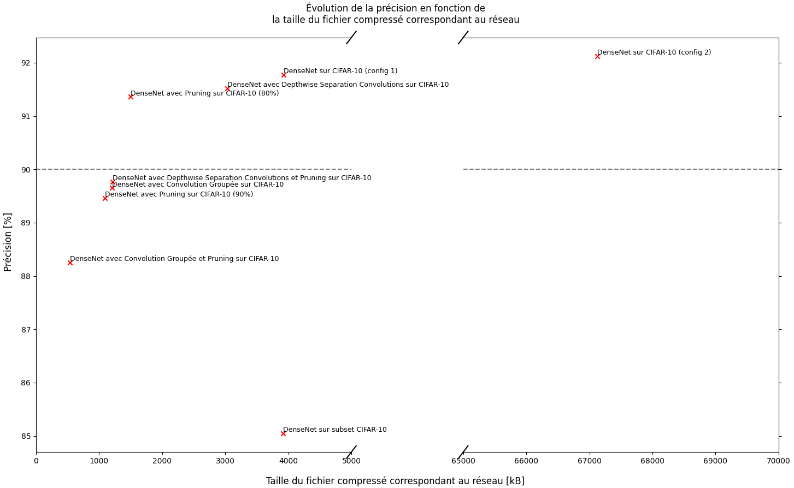

# Descriprion des réseaux de neurone utilisés

<code>densnet_group.pth</code> : DenseNet avec Convolution Groupée sur CIFAR-10

<code>densnet_group_pruning.pth</code> : DenseNet avec Convolution Groupée et Pruning à 80% sur CIFAR-10

<code>densnet_naif.pth</code> : DenseNet non modifié sur CIFAR-10

<code>densnet_naif_201.pth</code> : DenseNet non modifié avec d'autres paramètres (DenseNet201) sur CIFAR-10

<code>densnet_naif_pruning.pth</code> : DenseNet non modifié avec Pruning à 80% sur CIFAR-10

<code>densnet_naif_pruning_90.pth</code> : DenseNet non modifié avec Pruning à 90% sur CIFAR-10

<code>densnet_naif_subset.pth</code> : DenseNet non modifié sur un sous ensemble de CIFAR-10

<code>densnet_sep.pth</code> : DenseNet avec Depthwise Separation Convolutions sur CIFAR-10

<code>densnet_sep_pruning.pth</code> : DenseNet avec Depthwise Separation Convolutions et Pruning à 80% sur CIFAR-10

# Résultats

